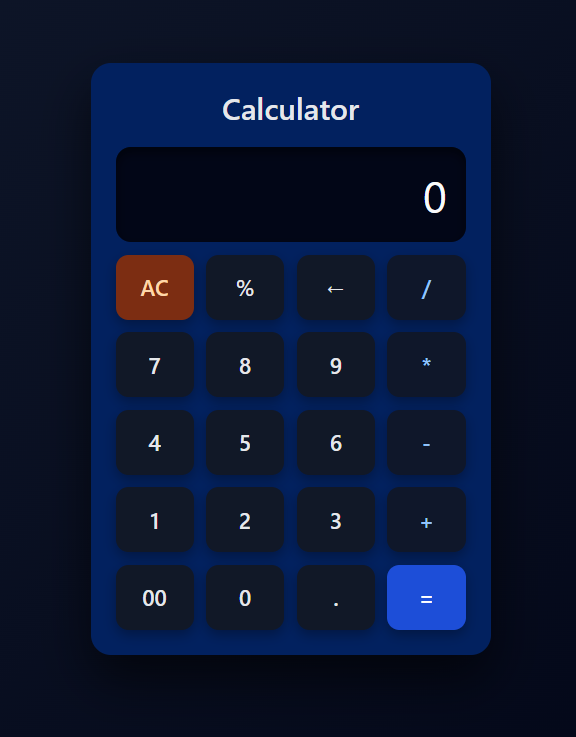

# 🧮 Modern Calculator

A sleek and responsive calculator built using **HTML, CSS, and JavaScript**.  
Designed with a modern dark UI and smooth user interactions.

---

## ✨ Preview

---

## 🚀 Features

- ➕ Basic arithmetic operations (+, −, ×, ÷)
- 💯 Percentage calculation
- ⌫ Backspace / delete support
- ⌨️ Keyboard input support
- ⚠️ Error handling (invalid expressions, divide by zero)
- 🎨 Modern dark-themed UI

---

## 🛠️ Tech Stack

- **HTML** → Structure  
- **CSS** → Styling & Layout  
- **JavaScript** → Logic & Interactivity

---

## 🧠 Concepts Practiced

- DOM Manipulation
- Event Handling
- State Management
- Input Validation
- Keyboard Event Listeners